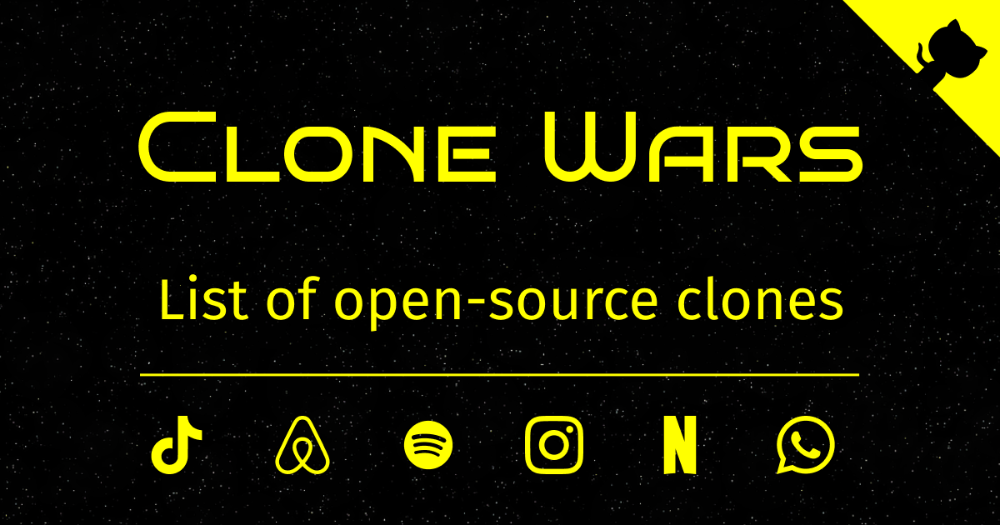

# Clone Wars - Open source clones of popular sites

> 70+ open-source clones of popular sites like Airbnb, Amazon, Instagram, Netflix, Tiktok, Spotify, Trello, Whatsapp, Youtube, etc. List contains source code, demo links, tech stack, and, GitHub stars count. Great for learning purpose!

_-Made by [@GorvGoyl](https://twitter.com/GorvGoyl)_

## See full list with better view 👉 [gourav.io/clone-wars](https://gourav.io/clone-wars)

---

- Liked this repo? [support it ♥](#support)
- Want to see your/their repo in list? see [contribution guide](#contribution)

_(scroll right on table to see all 5 columns)_

| Clone                          | Demo                                                                                                                                   | Repo                                                                                                                   | Tech stack                                        | Repo Stars                                                                                                                                                                                     |
| ------------------------------ | -------------------------------------------------------------------------------------------------------------------------------------- | ---------------------------------------------------------------------------------------------------------------------- | ------------------------------------------------- | ---------------------------------------------------------------------------------------------------------------------------------------------------------------------------------------------- |
| 2048                           | https://2048-three.vercel.app/                                                                                                         | https://github.com/AreebKhan619/2048                                                                                   | React                                             |                                                                                                                     |
| 2048                           | https://demo.matsz.dev/2048/                                                                                                           | https://github.com/mat-sz/2048                                                                                         | React, TypeScript, Redux                          |                                                                                                                           |
| Airbnb                         | https://abod-bnb.web.app/                                                                                                              | https://github.com/abodmicheal/React-projects/tree/master/Abodbnb                                                      | React, Firebase                                   |                                                                                                            |
| Amazon                         | https://amazonna.netlify.app/   https://youtu.be/MSctN0MOdt0                                                                       | https://github.com/emmanuelhashy/amazon-clone                                                                          | React, Firebase                                   |                                                                                                            |
| Amazon Prime                   | https://prime-clone-e1de6.firebaseapp.com/                                                                                             | https://github.com/peeyush14goyal/AmazonPrime-ReactJS-Clone                                                            | React                                             |                                                                                              |
| Apple Music                    | https://appo-music.herokuapp.com/                                                                                                      | https://github.com/oriravid/Appo-Music                                                                                 | React, Redux, Ruby on Rails, PostgreSQL           |                                                                                                                   |
| Battleship Game                | https://battleboats.ito.wtf/                                                                                                           | https://github.com/hairarrow/btship                                                                                    | TypeScript, React                                 |                                                                                                                      |
| Clubhouse                      | https://jam.systems/                                                                                                                   | https://github.com/jam-systems/jam                                                                                     | React, WebRTC                                     |                                                                                                                       |
| Codecademy                     | https://codecademyclone.netlify.app/                                                                                                   | https://github.com/shanoysinc/Codecademy-clone                                                                         | React                                             |                                                                                                           |
| Discord                        | http://ericellb.github.io/React-Discord-Clone                                                                                          | https://github.com/ericellb/React-Discord-Clone                                                                        | React, Node, Express, Socket-IO, MySQL            |                                                                                                          |
| Discord                        | https://valkyrieapp.xyz                                                                                                                | https://github.com/sentrionic/Valkyrie                                                                                 | React, NestJS, TypeScript, Socket-IO, PostgreSQL  |                                                                                                                   |
| Disney+                        | https://github.com/calebnance/expo-disneyplus/blob/master/.gh-assets/screenshare-4.png?raw=true                                        | https://github.com/calebnance/expo-disneyplus                                                                          | React Native, expo                                |                                                                                                            |
| Dribbble                       | http://driwwwle.herokuapp.com/                                                                                                         | https://github.com/itsnitinr/driwwwle                                                                                  | MERN, react                                       |                                                                                                                    |
| Dribbble                       | https://v.redd.it/a8lhmpjho0051/                                                                                                       | https://github.com/diazabdulm/rumbbble                                                                                 | MongoDB, ExpressJS, React,                        |                                                                                                                   |
| Facebook                       | https://odinclone.herokuapp.com/                                                                                                       | https://github.com/lucaskenji/odinclone-app                                                                            | MERN                                              |                                                                                                              |
| Facebook                       | https://github.com/KristianWEB/fakebooker-frontend#screenshots                                                                         | https://github.com/KristianWEB/fakebooker-frontend                                                                     | react, graphql, mongodb                           |                                                                                                       |
| Gmail                          | https://github.com/rodydavis/gmail_clone#screenshots                                                                                   | https://github.com/rodydavis/gmail_clone                                                                               | Flutter                                           |                                                                                                                 |
| Google Drive                   | https://mydrive-demo.herokuapp.com/                                                                                                    | https://github.com/subnub/myDrive                                                                                      | React, Node.js, mongoDB                           |                                                                                                                        |
| Google Keep                    | https://googlekeep-anselm94.herokuapp.com/login   https://github.com/anselm94/googlekeepclone/blob/master/docs/mobile-add-todo.gif | https://github.com/anselm94/googlekeepclone                                                                            | React, GraphQL, Golang, SQlite                    |                                                                                                              |
| Google Keep                    | https://vue-keep-sepia.vercel.app/                                                                                                     | https://github.com/wobsoriano/vue-keep                                                                                 | Vue, Typescript, Firestore                        |                                                                                                                   |
| Google Keep                    | https://google-keeps-clone.herokuapp.com/                                                                                              | https://github.com/kimlimjustin/google-keep-clone                                                                      | Django, JS                                        |                                                                                                        |
| Google Forms                   | http://google-forms-clone.herokuapp.com/                                                                                               | https://github.com/kimlimjustin/google-form-clone                                                                      | Django, JS                                        |                                                                                                        |
| Google Photos                  | https://photos-clone.web.app/                                                                                                          | https://github.com/mani-barathi/Google-Photos-Clone                                                                    | React, Redux, Firebase                            |                                                                                                      |
| Hackernews                     | https://hackernews-redesign.netlify.app/                                                                                               | https://github.com/RocktimSaikia/hacker-news-redesign                                                                  | React                                             |                                                                                                    |
| Hackernews                     | https://news.python.sc/                                                                                                                | https://github.com/sebst/pythonic-news                                                                                 | Python, Django                                    |                                                                                                                   |
| IMDB                           | https://imdb-react-clone.herokuapp.com/                                                                                                | https://github.com/djohal/imdb-replica-react                                                                           | React, Redux, Firebase                            |                                                                                                             |
| Instagram                      | https://www.instaclone.net/login   https://github.com/Sandermoen/instaclone/blob/master/screenshots/NgmjOVkZ4L.gif                 | https://github.com/Sandermoen/instaclone                                                                               | Reactjs, Express, Nodejs, Mongodb, Socketio       |                                                                                                                 |
| Instagram                      | https://github.com/vipulasri/JetInstagram/blob/master/art/jetinstagram.gif                                                             | https://github.com/vipulasri/JetInstagram                                                                              | Jetpack Compose                                   |                                                                                                                |
| iOS Homescreen                 | https://ios-homescreen.now.sh/                                                                                                         | https://github.com/erickbogarin/ios-homescreen                                                                         | React, Next.js, Emotion                           |                                                                                                           |
| Jira                           | https://i.ibb.co/W3qVvCn/jira-optimized.jpg                                                                                            | https://github.com/oldboyxx/jira_clone                                                                                 | React, Typescript                                 |                                                                                                                   |
| MacOS Calculator               | https://chamoda.com/react-calculator/                                                                                                  | https://github.com/chamoda/react-calculator                                                                            | React                                             |                                                                                                              |
| MacOS Notes app                | https://hubert-wyszynski.github.io/notes-app/                                                                                          | https://github.com/hubert-wyszynski/notes-app                                                                          | React                                             |                                                                                                            |
| Medium                         | https://next-realworld.now.sh/                                                                                                         | https://github.com/reck1ess/next-realworld-example-app                                                                 | React, Next.js                                    |                                                                                                   |
| MS Paint                       | https://jspaint.app                                                                                                                    | https://github.com/1j01/jspaint                                                                                        | Node.js                                           |                                                                                                                          |
| Netflix                        | https://azazel5.github.io/NetflixClone/   https://github.com/Azazel5/NetflixClone/blob/master/flixdemo.gif                         | https://github.com/Azazel5/NetflixClone                                                                                | React, Redux                                      |                                                                                                                  |
| Netflix                        | https://netflix-clone-dd230.web.app/                                                                                                   | https://github.com/abodmicheal/React-projects/tree/master/Single-Channel-Messanger                                     | React, Firebase                                   |                                                                                                            |
| Netflix                        | https://github.com/karlhadwen/netflix/blob/master/netflix-preview.png                                                                  | https://github.com/karlhadwen/netflix                                                                                  | React, Firebase                                   |                                                                                                                    |
| Netflix                        | http://spaceflix.herokuapp.com/#/                                                                                                      | https://github.com/ehecker/spaceflix                                                                                   | Ruby, React, Redux, PostgreSQL, AWS               |                                                                                                                     |
| Netflix                        | https://expo-netflix.calebnance.now.sh/                                                                                                | https://github.com/calebnance/expo-netflix                                                                             | React Native, expo                                |                                                                                                               |
| Netflix                        | https://roseflix-rosebilag.vercel.app/                                                                                                 | https://github.com/rosebilag/roseflix/                                                                                 | React, TypeScript, MongoDB                        |                                                                                                                    |
| Nike                           | https://github.com/saeed9321/Nike-Website-clone/blob/main/screen-capture.gif                                                           | https://github.com/saeed9321/Nike-Website-clone                                                                        | Express, MongoDB                                  |                                                                                                          |
| Omegle                         | https://start-a-conversation.firebaseapp.com/                                                                                          | https://github.com/NickMandylas/start-a-conversation                                                                   | React, Firebase, Twilio                           |                                                                                                     |
| Orkut                          | https://orkutnostalgia.netlify.app/                                                                                                    | https://github.com/GShadowBroker/orkut-clone-client   https://github.com/GShadowBroker/orkut-clone-server          | ReactJS, GraphQL, Apollo, PostgreSQL              |            |
| PayTM                          | https://github.com/flutter-devs/flutter_paytm_clone#demo                                                                               | https://github.com/flutter-devs/flutter_paytm_clone                                                                    | Flutter                                           |                                                                                                      |
| Pinterest                      | https://trusting-euler-8aafb8.netlify.app/                                                                                             | https://github.com/machadop1407/pinterest-clone-frontend   https://github.com/machadop1407/pinterest-clone-backend | GraphQL, ReactJS, NodeJS, Mysql                   |   |
| Reddit                         | https://redditsyncr.netlify.app/                                                                                                       | https://github.com/dustinkiselbach/reddit-refactor                                                                     | React, Typescript                                 |                                                                                                       |
| Reddit                         | https://asperitas.now.sh/                                                                                                              | https://github.com/d11z/asperitas                                                                                      | Node.js, React, NoSQL                             |                                                                                                                        |
| TikTok-Reddit                  | https://reddit-tiktok.netlify.app/                                                                                                     | https://github.com/hedgecox/Reddit-TikTok-Clone                                                                        | React                                             |                                                                                                          |
| Twitch                         | https://twitchclone.vercel.app/                                                                                                        | https://github.com/alissonsleal/twitch-clone/                                                                          | React, Next.JS, Typescript                        |                                                                                                             |
| skribbl.io                     | http://skribbl-env.eba-4374ebsp.us-east-2.elasticbeanstalk.com/                                                                        | https://github.com/nabinchaulagain/skribbl-clone                                                                       | React, Socket.io, Express                         |                                                                                                         |
| Slack                          | https://mattermost.com/                                                                                                                | https://github.com/mattermost/mattermost-webapp                                                                        | React                                             |                                                                                                          |
| Slack                          | https://github.com/calebnance/expo-slack/blob/master/screenshots/screenshare-3_v1.jpg?raw=true                                         | https://github.com/calebnance/expo-slack                                                                               | React Native, Expo                                |                                                                                                                 |
| Snapchat                       | https://towhidkashem.github.io/snapchat-clone/   https://youtu.be/aRS88v-duKg                                                      | https://github.com/TowhidKashem/snapchat-clone                                                                         | React, Redux, Typescript, Cypress, Jest, Enzyme   |                                                                                                           |
| Spotify                        | https://github.com/JL978/spotify-clone-client/blob/master/demo/Authed.gif                                                              | https://github.com/JL978/spotify-clone-client                                                                          | React                                             |                                                                                                            |
| Spotify                        | https://github.com/matpandino/spotify-ui-clone/blob/master/.github/spotify-clone.jpg                                                   | https://github.com/matpandino/spotify-ui-clone                                                                         | Electron, React, Typescript                       |                                                                                                           |
| Spotify                        | https://drive.google.com/file/d/1KOHOJDGaLeumGqQenzCeeShPqIudCJBX/view                                                                 | https://github.com/aashrafh/Oud                                                                                        | React                                             |                                                                                                                          |
| Spotify                        | https://tune42-spotify.netlify.app/                                                                                                    | https://github.com/Tune42/spotify-clone                                                                                | React                                             |                                                                                                                  |
| Spotify                        | https://expo-spotify.calebnance.now.sh/                                                                                                | https://github.com/calebnance/expo-spotify                                                                             | React Native, Expo                                |                                                                                                               |
| Spotify                        | https://github.com/osamaq/spotify-lite#screenshots                                                                                     | https://github.com/osamaq/spotify-lite                                                                                 | React Native                                      |                                                                                                                   |
| Spotify + Soundcloud + YouTube | https://www.kord.app                                                                                                                   | https://github.com/bundit/kord-app                                                                                     | React, Redux, Express, PostgreSQL                 |                                                                                                                       |
| Stackoverflow                  | https://clone-of-stackoverflow.vercel.app/                                                                                             | https://github.com/salihozdemir/stackoverflow-clone                                                                    | ReactJs, NextJs, Express, MongoDB                 |                                                                                                      |
| Stackoverflow                  | https://drive.google.com/file/d/1A0B3JPUUY2snG8MLZpyz2LWhvThG2epn/view                                                                 | https://github.com/Mayank0255/Stack-Overflow-Clone                                                                     | MySQL, Express, React                             |                                                                                                       |
| Tetris Game                    | https://hinsxd-tetris.netlify.app/                                                                                                     | https://github.com/hinsxd/react-tetris                                                                                 | React, Typescript                                 |                                                                                                                   |
| Tetris Game                    | https://tetris20.netlify.app/                                                                                                          | https://github.com/shanoysinc/Tetris                                                                                   | Typescript                                        |                                                                                                                     |
| Tiktok                         | https://youtu.be/iYqDUjvsS3o                                                                                                           | https://github.com/emmanuelhashy/tik-tok-clone                                                                         | React, Firebase                                   |                                                                                                           |
| Tiktok                         | https://youtu.be/sMKg6ILYgv0                                                                                                           | https://github.com/salvadordeveloper/TikTok-Flutter                                                                    | Flutter, Firebase                                 |                                                                                                      |
| Tiktok-Reddit                  | https://henrybalassiano.github.io/Tik-Tok-Clone/                                                                                       | https://github.com/HenryBalassiano/Tik-Tok-Clone                                                                       | React                                             |                                                                                                         |
| Trello                         | https://trellis-app.herokuapp.com/   https://github.com/ayushagg31/Trellis/blob/master/images/Trellis.gif                          | https://github.com/ayushagg31/Trellis                                                                                  | React, Redux, Node, Express, MongoDB              |                                                                                                                    |
| Trello                         | https://codesource.io/wp-content/uploads/2020/07/Trelloclone.webm                                                                      | https://github.com/Dunebook/Trelloclone                                                                                | Angular 10                                        |                                                                                                                  |
| Trello                         | https://tiquetapp.herokuapp.com/                                                                                                       | https://github.com/FLiotta/Tiquet                                                                                      | React, Python, Flask, PostgreSQL                  |                                                                                                                        |
| Trello                         | https://tberghuis.github.io/trello-board-clone/                                                                                        | https://github.com/tberghuis/trello-board-clone                                                                        | React                                             |                                                                                                          |
| trello                         | https://rupmalya-trello-clone.herokuapp.com/signin   https://youtu.be/59oQ01VEm30                                                  | https://github.com/RupmalyaK/trello-clone                                                                              | Express, MongoDB                                  |                                                                                                                |
| trello                         | https://project-manager1.herokuapp.com/                                                                                                | https://github.com/arturmolenda/project-manager                                                                        | React, Redux, Node, Express, Socket.io, MongoDB   |                                                                                                          |
| Twitter                        | https://twitter-geek.netlify.app/#/   https://github.com/RisingGeek/twitter-clone/blob/master/demo/feed.png                        | https://github.com/RisingGeek/twitter-clone   https://github.com/RisingGeek/twitter-clone-backend                  | React, Redux, NodeJS, MYSQL                       |                    |
| Twitter                        | https://twitterclone2.netlify.app/login.html                                                                                           | https://github.com/Dunebook/Twitterclone                                                                               | HTML, CSS, JQuery                                 |                                                                                                                 |
| Twitter                        | https://tclone.netlify.app/   https://github.com/muzam1l/tclone/raw/master/docs/tclone-demo2.gif                                   | https://github.com/muzam1l/tclone   https://github.com/muzam1l/tclone-api                                          | MERN                                              |                                            |
| Twitter                        | https://twitterapp-clone.netlify.app/home                                                                                              | https://github.com/Ali-hd/Twitter-Clone   https://github.com/Ali-hd/TwitterClone-Backend                           | React, express, mongo, aws, socket.io             |                             |
| Uber                           | https://github.com/calebnance/expo-uber/blob/master/screenshots/screenshare-3.png?raw=true                                             | https://github.com/calebnance/expo-uber                                                                                | React native, expo                                |                                                                                                                  |
| Uber                           | https://youtu.be/ya1lsXS2Wvw                                                                                                           | https://github.com/Santos-Enoque/uber_clone_with_flutter                                                               | Flutter                                           |                                                                                                 |
| Unsplash                       | https://github.com/junipdewan/react-unsplash#react-unsplash                                                                            | https://github.com/junipdewan/react-unsplash                                                                           | React                                             |                                                                                                             |
| Vimeo                          | https://bimeo.herokuapp.com/#/                                                                                                         | https://github.com/TarikGul/vimeo_clone_full_stack_project                                                             | React, Redux, Ruby. PostgreSQL                    |                                                                                               |
| Whatsapp                       | https://codesource.io/wp-content/uploads/2020/11/Screenshot_20201029-171635-1-709x1536.png                                             | https://github.com/Ekeminie/whatsapp_ui                                                                                | Flutter                                           |                                                                                                                  |
| Whatsapp                       | https://medium.com/p/5479d83baaa4                                                                                                      | https://github.com/Urigo/WhatsApp-Clone-Client-Angular   https://github.com/Urigo/WhatsApp-Clone-server            | Angular, Express, PostgreSQL, GraphQL, Typescript |              |
| Whatsapp                       | https://youtu.be/3TYfkvf4u4M   https://clone-massenger.herokuapp.com/signinsignup                                                  | https://github.com/RupmalyaK/whatsapp-MERN                                                                             | MERN                                              |                                                                                                               |
| Workflowy                      | https://deepnotes.in/                                                                                                                  | https://github.com/mukeshsoni/deepnotes-editor                                                                         | ReactJS, DraftJS                                  |                                                                                                           |
| Youtube                        | https://utubeclone.netlify.app/   https://youtu.be/wHLurtOnmyM                                                                     | https://github.com/manikandanraji/youtubeclone-frontend   https://github.com/manikandanraji/youtubeclone-backend   | React, Redux, Express, Sequelize                  |     |

_Some link is broken? [report it](https://github.com/GorvGoyl/Clone-Wars/issues/new)_

---

## Support

#### ❤ Clone Wars is live on [Product Hunt](https://www.producthunt.com/posts/clone-wars/). Check it out!

#### 💲 Support continuous development [Buy me a Coffee](https://ko-fi.com/gorvgoyl)

  

#### 👨‍💻 Follow the maker [@GorvGoyl [Twitter]](https://twitter.com/GorvGoyl) behind this project.

---

## Contribution

2 ways to add your/their repo to the list:

1. Add your contribution to [readme.md](https://github.com/GorvGoyl/Clone-Wars/blob/main/README.md) (_you may use online md editor like [markdown.site](https://markdown.site/) for better table visualization_) and send me a PR! (_faster approval and your name would be added to project contributors_)  
   OR
2. Create a [new issue](https://github.com/GorvGoyl/Clone-Wars/issues/new) with following details: clone name, code repo link, demo link, and tech stack used.

Any other feedback is also welcome :)
